# Test

Automation which is demanding across the globe today saves human time
and energy to a great extent. PHP tools are used to test unit as well as
an end-to-end testing using BDD (Behavior- Driven Development) and TDD
(Test- Driven Development).

Turning now to the implementation of test in the project, we will choose
to make tests for the PHP project because our company Medianet use PHP
language in the development of projects.

The most type of CI test that we need in these projects are:

-   Unit test

-   Static test

-   Integration test

# Unit test:

Starting with unit tests, there are three ways for the implementation of
these tests:

-   TDD -test driven development (tests state -write tests first, then
    write code

-   BDD -behavior driven development (test behavior of the software)

-   ATDD -acceptance test driven development

# Unit test using git:

These are the tasks we require to do our first unit test.

## task 1: show the test code

2 methods exist:

-   Get the code from git so we have to install git

-   Create a directory where we find the test code

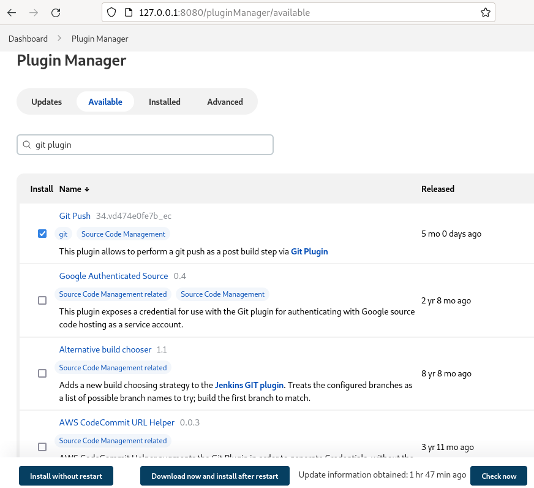

##task 2: install the plugins that we need

We select git push then press download now and install after restart

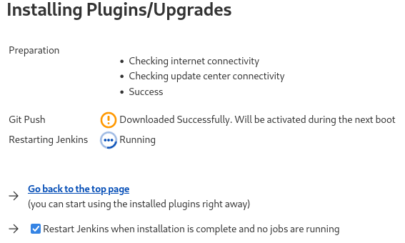

So, this figure appears

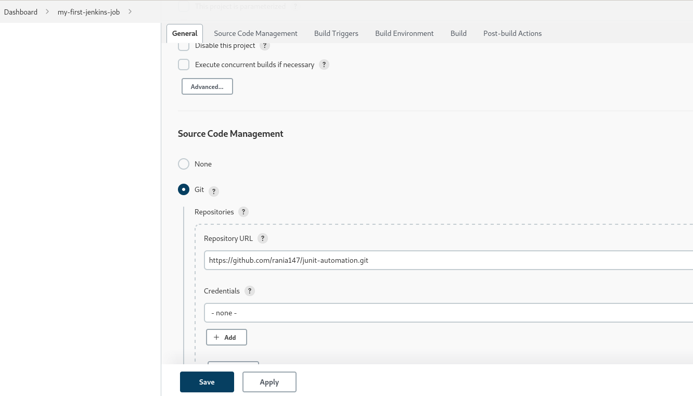

## task 3: create and configure a job

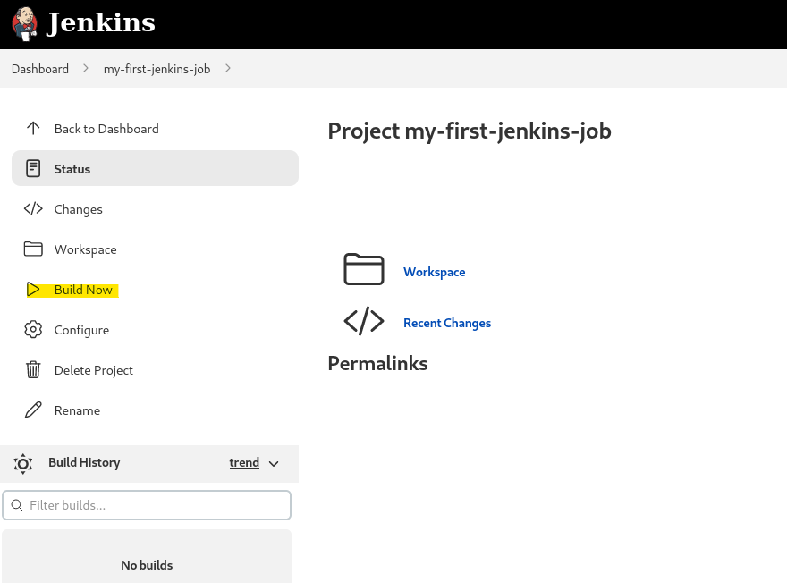

Then, we press the buttons save, and finally build now

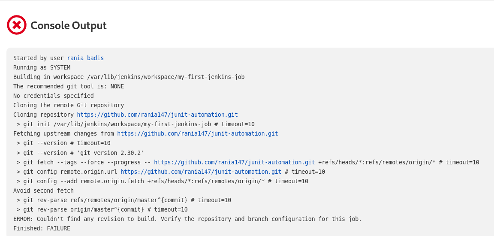

## task 4: test if it works

This figure \"console output\" shows all the details about the test; if
the test doesn\'t work, we can get all the details right here to fix the
problem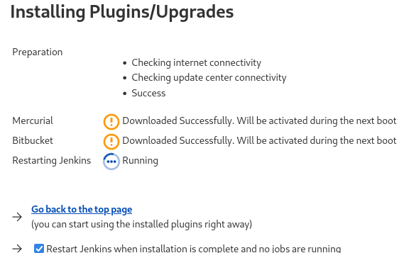

#Unit test using bitbucket:

## What is bitbucket?

Bitbucket is a Git-based source code repository hosting service owned by
Atlassian. Bitbucket offers both commercial plans and free accounts with
an unlimited number of private repositories.

## Task 1: install bitbuckets plugins

We do the same thing we do when installing git plugins.

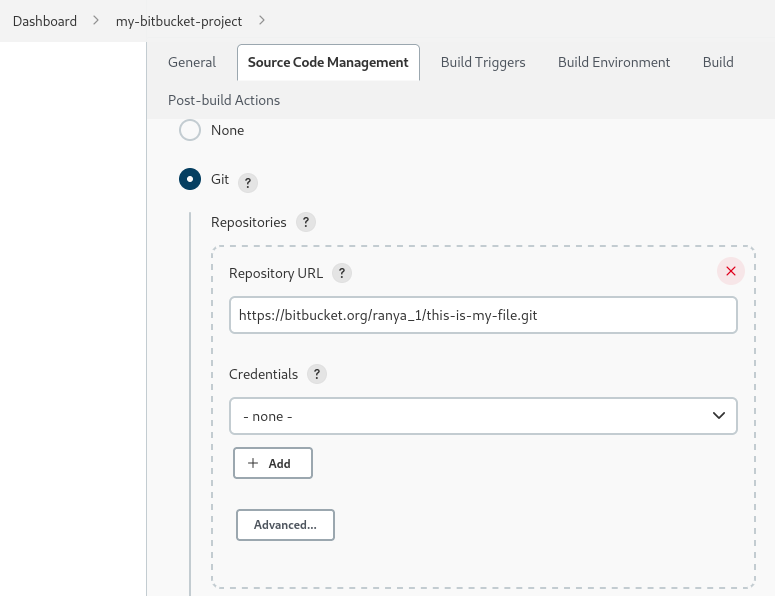

## Task 2: create and configure a job

We click on "new item" in the dashboard of Jenkins then we give the name
of the project "my-Bitbucket-project" and choose the option "freestyle
project", this figure represents the next step:

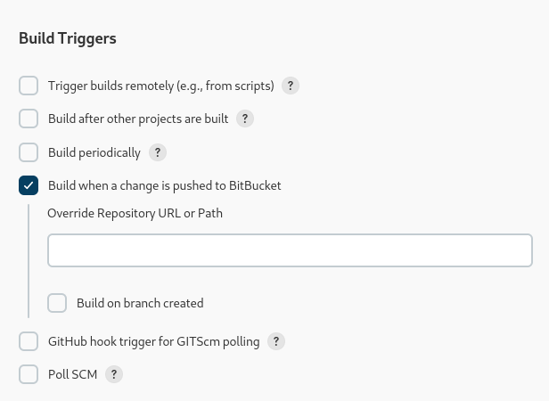

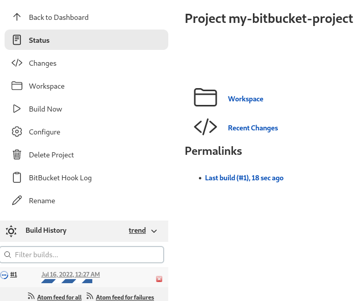

Then press "build now" button

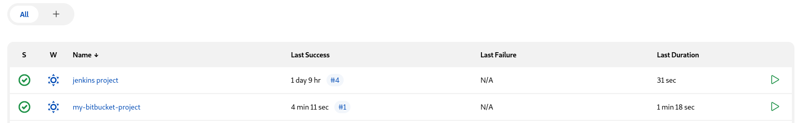

This figure represents dashboard of Jenkins, and it shows the status of
the build: success

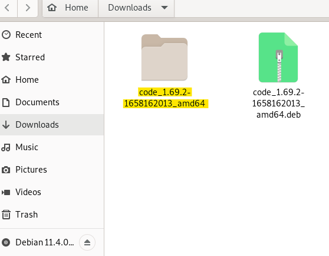

As I know Medianet is a company that uses PHP to program their code so
we need to run tests on these codes using phpunit test.

## PHP unit test (calculator):

Try to execute a PHP unit test using Vs code of a calculator

## Task 1: install needs

### Install Vs code

Install dependencies of vs code in the Virtual machine

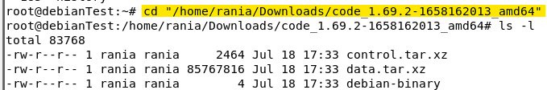
Go to the directory of the dependencies:

\$ cd "/home/rania/Downoads/code_1.69.2-1658162013_amd64"

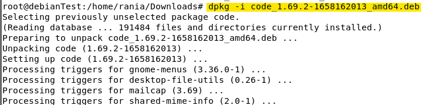

Install vs code throw this command

\$ dpkg -i code_1.69.2-1658162013_amd64

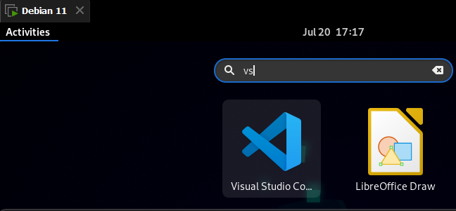

Then in the search box type vs code

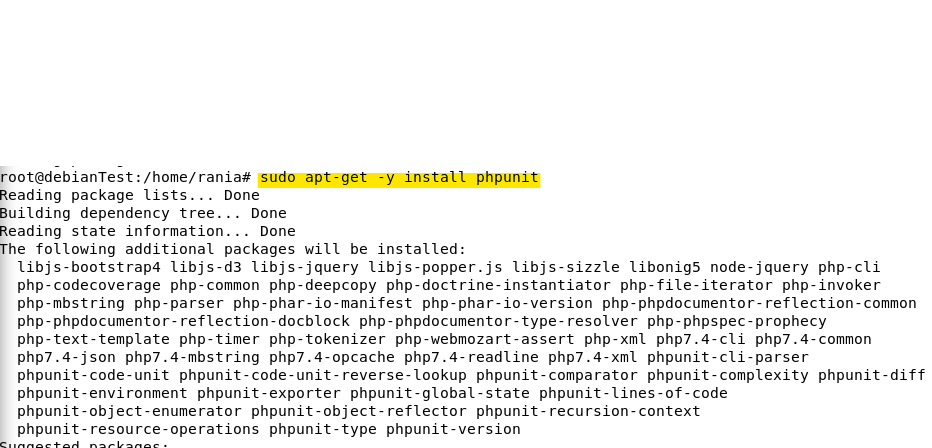

### install phpunit

\$ sudo apt-get -y install phpunit

{width="6.3in" height="1.8798611111111112in"}

### install PHP composer

We go to the folder where the code of the calculator existe and run the
following command

\$ curl -sS <https://getcomposer.org/installer> \| php

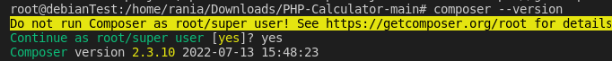

Then to verify composer version type

\$ composer --version

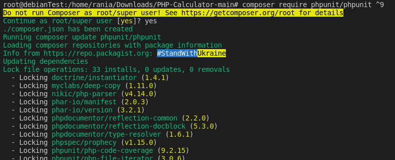{width="5.683825459317585in"
height="0.5667158792650918in"}

## Step 2: import the dependencies for PHP unit

\$ composer require phpunit/phpunit \^9

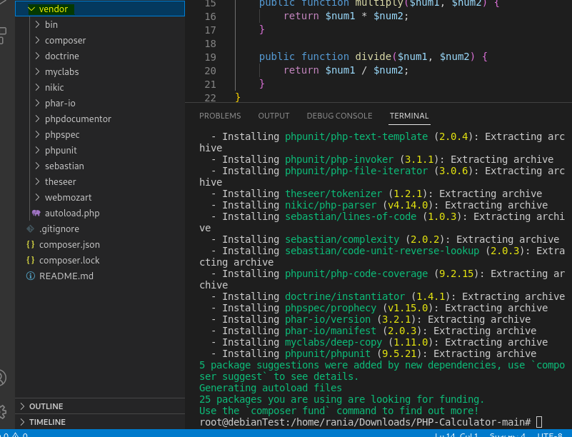
So, the vendor directory is created automatically

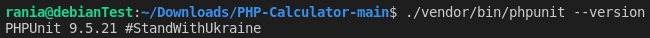

Version of PHP unit :

*\$ ./vendor/bin/phpunit --version*

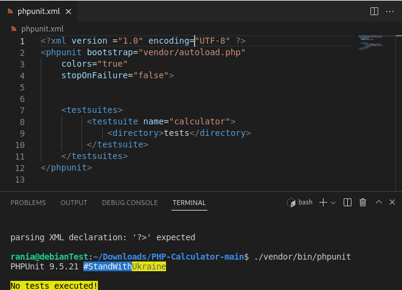

## Step 3: create of the files

### create the xml file

We created a new file called phpunit.xml, then we try this command
''./vendor/bin/phpunit '' to verify that there is no test execute

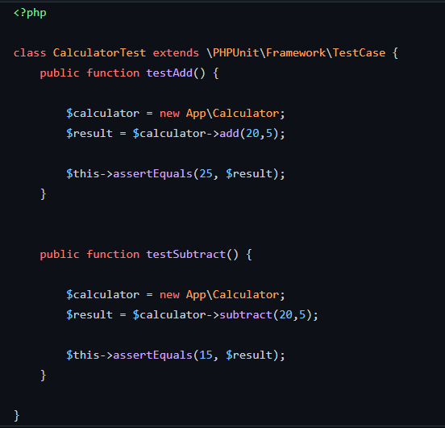

### create the PHPunit test file

We add a folder « test », then a file named « CalculatorTest »

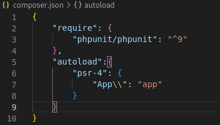

## Step 4: test the code

In the composer.json file, we enter the script shown in the figure
below, then we update the composer

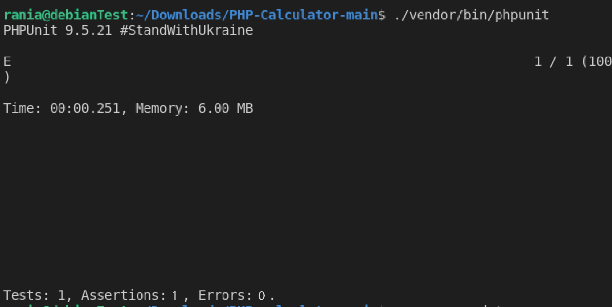

Finally, we run the command "./vendor/bin/phpunit"; Here I found the
result of the test with the time consumed and the memory
measured

And in this directory, I put the project containing all the previous
files https://github.com/rania147/php_calculator
